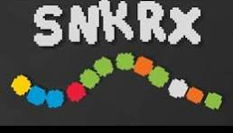

# Unit 1 project - SNKRX

A twist on the classic Snake, this **autobattler roguelike** by [a327ex](https://store.steampowered.com/developer/a327ex) pits your snake against enemy chiplets in successively difficult arenas, and offers unit upgrades after clearing each arena. The Steam version is more complex than mine.

The snake is made up of units with different abilities. The player's job is to steer the snake during the arenas, getting close enough to the enemy chiplets to do damage without getting close enough to collide and lose hp.

After clearing each arena, a choice of unit upgrades is available. The original uses coins to buy units, but I am doing a simple pick-1-of-3 system. Collecting a new unit adds it to your snake as a lvl-1 unit. Collecting enough copies of the same unit upgrade makes that unit more powerful.

The enemy chiplets come in a few different flavors:

| color | effect |
|:----|:---|
|red| basic, slowly chases the snake|
|blue|when defeated, shoots damaging projectiles|
|green|when defeated, gives its allies a speed boost to swarm the snake|
|purple|when defeated, spawns several tiny critters|
|white|stationary, but shoots damaging projectiles at the snake|
|yellow|periodically launches allies at the snake|
|**boss**|extra size and health, and every 10 seconds triggers a color effect from above|

Each arena consists of a few waves of chiplets spawning in random locations. Waves include mostly red chiplets; on higher difficulty levels, more chiplets are of the more dangerous colors.

#### [Project rubric](https://pages.git.generalassemb.ly/modular-curriculum-all-courses/browser-based-game-project/project-requirements/)

#### [Deployed project](https://radford-coding.github.io/snkrx-inspired-browser-game/)

#### Sources I found helpful for understanding:

1. [atan2](https://en.wikipedia.org/wiki/Atan2) - figuring out how to get objects to chase each other was hard for me
2. [MDN canvas tutorial](https://developer.mozilla.org/en-US/docs/Games/Tutorials/2D_Breakout_game_pure_JavaScript) - amazing for my understanding of basic 2D rendering with `<canvas>`
2. [MDN-recommended canvas docs](https://bucephalus.org/text/CanvasHandbook/CanvasHandbook.html)
2. [keeping rendering times down](https://stackoverflow.com/questions/11150779/redrawing-html5-canvas-incredibly-slow)
3.  [JS file organization for web games](http://buildnewgames.com/js-game-code-org/)
4. [MDN maze game tutorial](https://developer.mozilla.org/en-US/docs/Games/Tutorials/HTML5_Gamedev_Phaser_Device_Orientation) - uses [Phaser](https://phaser.io/), which I am not, but shows good organization and logic
5. [game opensource audio sounds](https://gomakethings.com/how-to-play-a-sound-with-javascript/)
6. [loading JS audio files](https://stackoverflow.com/a/58898545)
7. [UI elements](https://uiverse.io/)
8. [matching canvas size to dynamic grid size](https://stackoverflow.com/questions/21179779/canvas-arc75-75-50-0-3-1415-true-draws-oval-instead-of-circle)
9. [MDN tutorial on bouncing ball simulation](https://developer.mozilla.org/en-US/docs/Learn_web_development/Extensions/Advanced_JavaScript_objects/Object_building_practice)
9. [smooth hover descriptions](https://stackoverflow.com/questions/38567028/fade-in-out-element-on-parent-div-hover-with-css)
9. (CSS font sizing)[https://www.sitepoint.com/understanding-and-using-rem-units-in-css/]